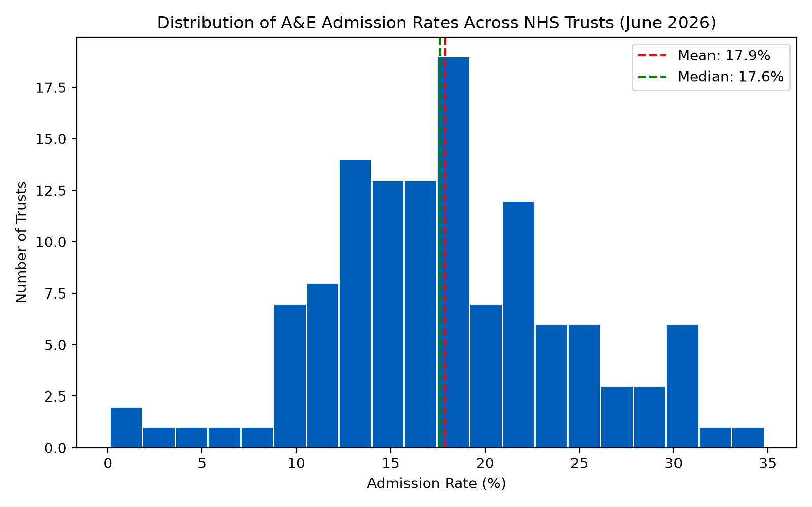
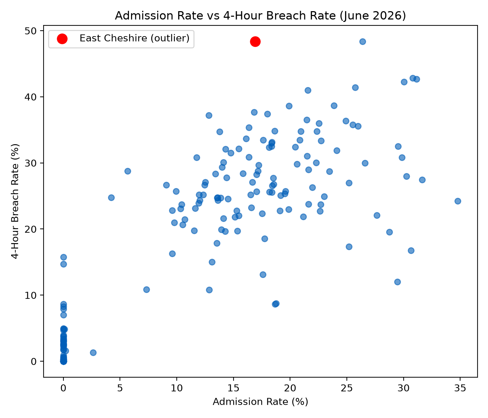

# NHS A&E Admissions Analysis (Project 1)

Analysis of NHS England's A&E Attendances and Emergency Admissions data (June 2026), 
examining hospital performance metrics across 192 NHS Trusts in England.

## Data Source

Data sourced from NHS England's open statistics publication (Monthly A&E Attendances 
and Emergency Admissions). The dataset covers attendance counts, 4-hour wait breaches, 
and admission figures at Trust level for June 2026.

**Note:** ECDS-based demographic breakdowns (age, gender, ethnicity) are marked 
"experimental" by NHS England and were not used in this analysis; the standard 
monthly figures remain the official source.

## Methodology

- Loaded the June 2026 monthly A&E dataset using pandas
- Inspected the data: checked shape (193 rows × 22 columns) and confirmed no missing values
- Reviewed column definitions to understand what each field represents
- Discovered a hidden "Total" summary row mixed into the real Trust-level data; removed it 
  before any aggregation to avoid double-counting (192 Trusts remained)
- Calculated total attendances (unplanned, booked, and combined) and total emergency 
  admissions via A&E per Trust
- Calculated admission rate (%) as emergency admissions ÷ total attendances
- Identified that a small number of Trusts returned an infinite admission rate, caused by 
  zero recorded attendances alongside non-zero admissions (traced to community/mental 
  health trusts without standard A&E departments)
- Replaced these infinite values with NaN so they were correctly excluded from further 
  statistical analysis
- Calculated 4-hour breach rate, and split it further into DTA (Decision To Admit) wait 
  buckets: 4-12 hours and 12+ hours
- Verified findings on small percentages against raw patient counts before drawing 
  conclusions
- Grouped Trusts by NHS region (Parent Org) to compare regional performance

## Key Findings

- **Admission rate and 4-hour breach rate are strongly correlated (r = 0.83)** across 
  the 192 Trusts — Trusts admitting a higher proportion of patients also tend to have 
  more patients breaching the 4-hour target, consistent with more complex cases taking 
  longer to process and place.

- **East Cheshire NHS Trust is a notable outlier**: its 4-hour breach rate (48.4%) matches 
  the highest in England, despite a comparatively low admission rate (16.9%) — well below 
  other Trusts with similarly severe breach rates. This suggests its wait-time pressure may 
  be driven more by general department congestion than by bed-capacity strain specifically, 
  though this is a hypothesis, not a confirmed cause.

- **Some Trusts show a "cascading severity" pattern**: breaking the 4-hour breach rate into 
  DTA wait sub-categories (4-12 hrs vs 12+ hrs) revealed that headline breach rate alone can 
  mask very different severity profiles. Nottingham University Hospitals had the most extreme 
  imbalance (severity ratio 6.93) — 1,067 patients waited 12+ hours after the decision to 
  admit, compared to only 155 in the 4-12 hour range. This was verified against raw patient 
  counts (not just percentages) to confirm it reflects genuine volume, not a small-sample 
  artifact.

- **Regional performance varies meaningfully**: NHS England North West had both the highest 
  average 4-hour breach rate (23.6%) and tied for the highest severe (12+ hr) wait rate 
  (2.79%) among all regions, while North East and Yorkshire had a relatively high overall 
  breach rate (20.1%) but the lowest severe-wait rate (0.68%) — indicating that region-level 
  breach rate alone doesn't capture how *severe* the underlying delays are.

## Charts

## Next Steps

- Extend the analysis across multiple months to identify trends over time, rather than a 
  single-month snapshot
- Apply formal statistical hypothesis testing to the admission rate / breach rate relationship
- Investigate the drivers behind regional disparities (e.g. Trust size, staffing, local 
  population) using additional NHS datasets

## Tools Used

Python, pandas, matplotlib
